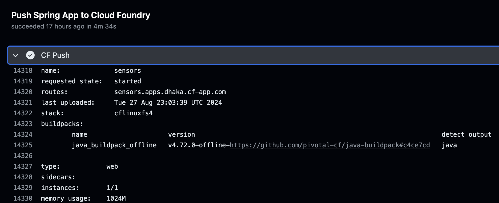

# CF Push Action for Github Workflows

### About

Github Action that leverages a user-supplied manifest to deploy Maven or Gradle apps to [Cloud Foundry](https://www.cloudfoundry.org/).

### Prerequisites

To use this action with your application, you must have the following:

**Cloud Foundry Credentials** You will need an API endpoint, username, and password for the Cloud Foundry environment you want to deploy to. Your account will need the `SpaceDeveloper` role in the org and space you are targeting.

**Cloud Foundry Manifest File** There should be a [Cloud Foundry manifest file](https://docs.cloudfoundry.org/devguide/deploy-apps/manifest.html#procedure) in the Git repo for your application.

### Create the Cloud Foundry password secret

You can create your secrets at the repo or organization level for use with your Github Workflow. Here are the steps for creating at the repo level:

From your source repo, click on Settings, and select Secrets and Variables / Actions

Using the "New Repository Secret" button, generate a secret with the following name:

* **CF_PASSWORD**: The password for your Cloud Foundry account 

### Set up the Github Workflow

In the root of your source code repo, create the workflow file `.github/workflows/cf-push-manifest.yaml`. Copy the contents of the [Sample Workflow](sample-workflow.yaml) into this file.

Replace the fields marked `<<ENTER VALUE>>` with your own values:
* `cf_api:` The API endpoint for your Cloud Foundry environment (e.g. https://api.cf.mycompany.com)
* `cf_user:` Your Cloud Foundry username
* `cf_org:` The organization you are deploying to
* `cf_space:` The space you are deploying to
* `manifest_file:` The path to the Cloud Foundry manifest file in your repo. The default is `./manifest.yml`.
* (Optional) `tests`: Boolean indicator of whether to run unit tests as part of the build. The default is `true`.

### Run the workflow

Commit your changes to Github. This will trigger a run of the workflow. You can track progress of the workflow under the Actions tab of your repo.

